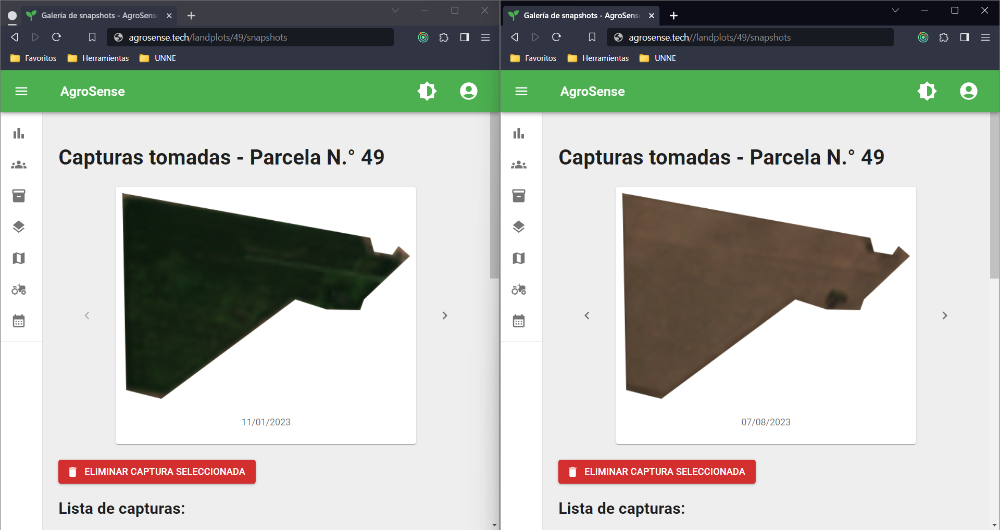

# AgroSense🌱 [](https://www.gnu.org/licenses/gpl-3.0)

AgroSense is a multi-tenant web app for agricultural management, which allows crop tracking through near real-time satellite imagery monitoring and crop calendar based tasks lists.

## Screenshots





## Technologies used

- PostgreSQL
- PostGIS
- Express
- React
- Leaflet
- TypeScript

## Repo structure

```
agro-gis/
├── client/
├── database/
├── deploy/
└── server/
```

The system responds to a client-server model and uses a PostgreSQL + PostGIS database to store its data.

You can find a plain-text SQL seed in `./database` to start the database with its init data.

The server was built using Express, while the web client was built with React and bootstrapped with create-react-app. You can find them in the `./server` and `./client` directories, respectively.

In the `./deploy` directory are the Compose and proxy configuration files to run the containerized application with Docker.

## Build instructions

Always remember to replace the `.env*.example` files with `.env*` files with your own variables.

### Setting up the development environment

Requirements:

1. [git](https://git-scm.com/downloads)
2. [PostgreSQL](https://www.postgresql.org/download/) with its [PostGIS extension](https://postgis.net/documentation/getting_started/)
3. [Node.js](https://nodejs.org/en/download/)
4. NPM

The first step is to `clone` the repo:

```bash
git clone https://github.com/horazini/agro-gis

# change directory
cd agro-gis
```

Once you are inside the `./agro-gis` directory, initialize your database with the seed data:

```bash
cd database
psql -U your-postgresql-username -d your-database-name -a -f pgseed.sql
```

This should fill your database with the tables and starting records.
If you can't run the command successfully, make sure you have PostgreSQL and PostGIS properly installed on your operating system.

Now you can install the server dependencies:

```bash
cd ../server

# this might take a while to complete
npm install
```

And start the server:

```bash
npm run dev
```

If you'd like to build in production mode:

```bash
npm run build

# run the server locally
npm start
```

Finally, for the web client:

```bash
cd ../client
npm install
```

Once the installation is finished, you can run it locally with:

```bash
npm start
```

Or build the source and serve it with a static server like `serve` or `nginx`.

```bash
npm run build

# then serve it with the static server of your choice
```

### Running it with Docker

The `./agro-gis/deploy` directory has the Compose YAML files required to run the containerized application in both staging and production environments. Build the images and start the containers with Docker Engine or Docker Desktop.

## License

Licensed under the [GNU General Public License, Version 3.0](https://www.gnu.org/licenses/gpl-3.0.txt)
